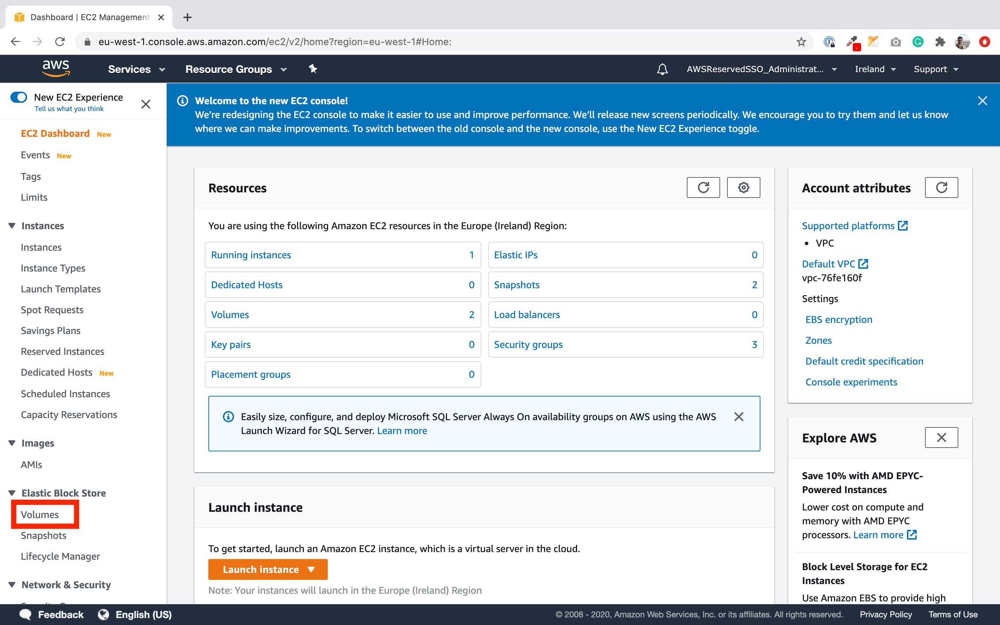
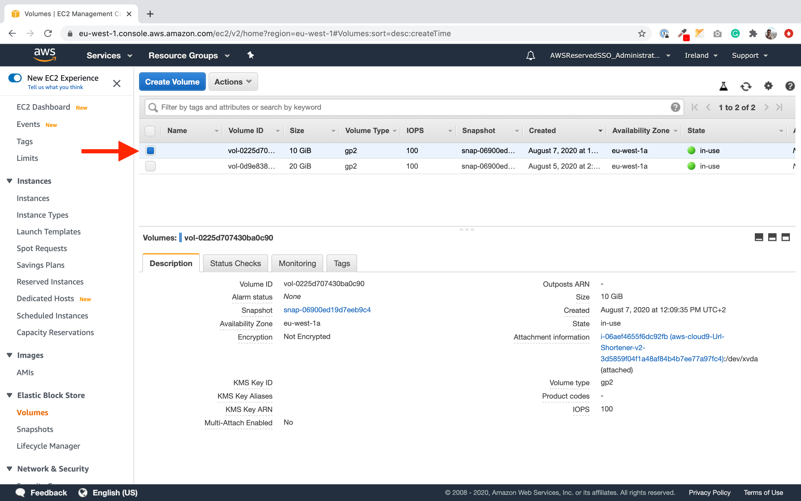
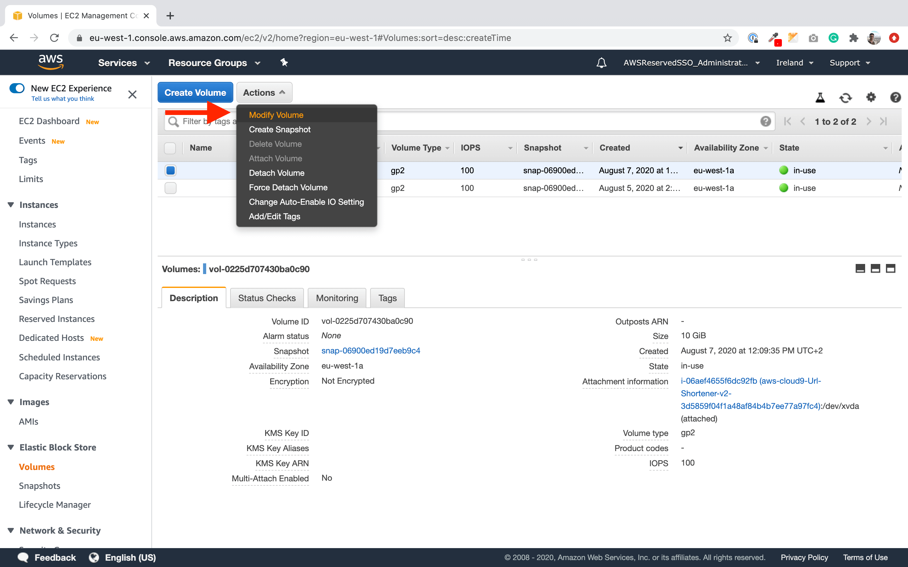
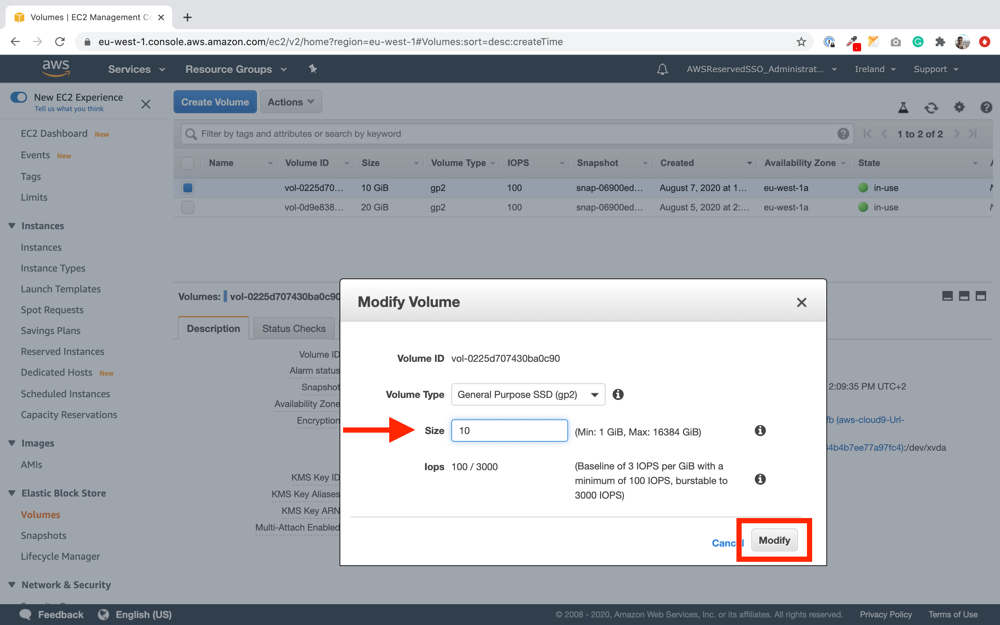
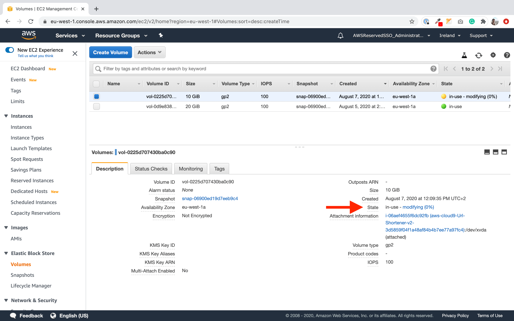

**In this Lab we will**:

- Setup the development environment
- Use [AWS SAM CLI](https://docs.aws.amazon.com/serverless-application-model/latest/developerguide/serverless-sam-cli-command-reference.html)
- Deploy a simple `hello-world` function
- Find logs and metrics for the function

**You completed this lab if you**:

- Successfully deployed the `hello-world` function
- Executed it once via the HTTP Endpoint (e.g using `curl`)
- Extended the function to generate some log output and found it in *Cloudwatch Logs*
- Took a look at the Dashboards for you function

## Setup

In order to setup the development environment in your AWS Account you have to log into the [AWS Console](https://console.aws.amazon.com/) via your
web browser. Use the user and credentials you created earlier.

Now we have to do the following steps to setup our development environment:

### Create Cloud9 Environment
- Open the [Cloud9 web interface](https://eu-central-1.console.aws.amazon.com/cloud9/home?region=eu-central-1#)
- Create a new environment
- Give it a name
- Leave all other settings untouched

### Allocate more disk space

By default, Cloud9 provisions 10 GiB of disk space for the IDE. In order to work with GO and install all dependencies, we need to allocate more disk space.

1. Open the [EC2 console](http://console.aws.amazon.com/ec2)
2. On the left side, click on **Volumes**:
  
3. Select the volume attached to the Cloud9 environment:
  
4. Click on **Actions** and then on **Modify Volume**:
  
4. Change the size from **10 GiB** to **20 GiB**. After that, click on **Modify**:
  
5. Wait until the change is applied. You can refreseh the page to see the latest status:
  

### Bootstrap
- Go back to your Cloud9 environment
- Open the terminal window and type:
- `git clone --single-branch --branch lab0 https://github.com/superluminar-io/serverless-workshop-go.git`
- `cd serverless-workshop-go`
- `./bootstrap.sh`

### Test
- `sam --version`
- `aws sts get-caller-identity`

### SAM

In this step, we are going to setup SAM and deploy the infrastructure for the first time. SAM will create a `samconfig.toml` file to persist your choices.

```sh
# Compile GO files
$ make build

# Configure SAM and deploy the infrastructure
$ sam deploy --guided

  Configuring SAM deploy
  ======================

  Looking for samconfig.toml :  Not found

  Setting default arguments for 'sam deploy'
  =========================================
  Stack Name [sam-app]: UrlShortener 
  AWS Region [us-east-1]: eu-central-1
  Confirm changes before deploy [y/N]: Y
  Allow SAM CLI IAM role creation [Y/n]: Y
  HelloWorldFunction may not have authorization defined, Is this okay? [y/N]: Y
  Save arguments to samconfig.toml [Y/n]: Y
```

## CloudFormation

If you check out the [CloudFormation console](https://eu-central-1.console.aws.amazon.com/cloudformation/home?region=eu-central-1) you will notice a new stack with the name you just defined in the guided deployment. CloudFormation is essentially a tool to provision, maintain and remove infrastructure in AWS. SAM uses CloudFormation under the hood to deploy the infrastrucutre we describe in this workshop.

Try to figure out:

- Which resources did we just deploy?
- What are outputs and why are they helpful?
