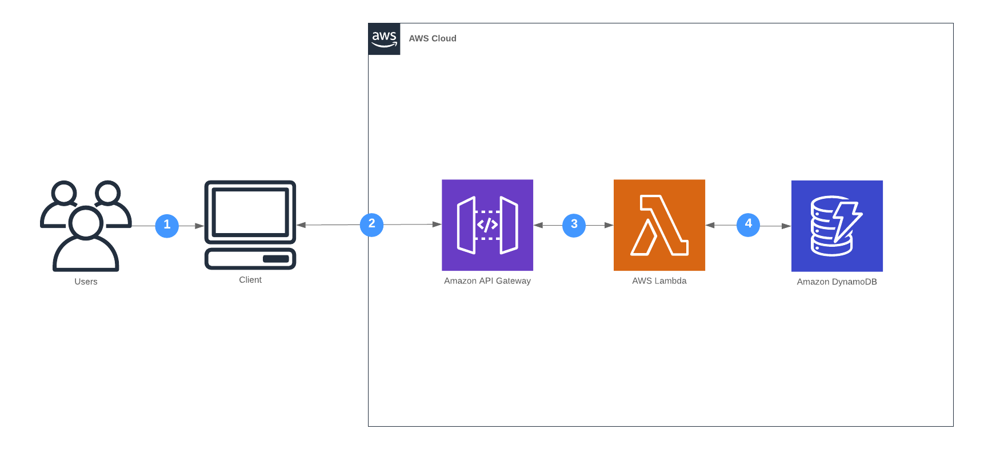

**In this Lab we will**:

- Create a first basic version of the url shortener
- Learn how to store data in AWS DynamoDB using the [AWS Go SDK](https://aws.amazon.com/sdk-for-go/)
- See some more advanced features of AWS SAM Templates

**You completed this lab if you**:

- Shortened at least one URL
- Typed the shortened URL into your browser and got redirected properly

## Overview

At the end of this lab the url shortener will consist of the following components.



## Implement a URL shortener using [DynamoDB](https://docs.aws.amazon.com/amazondynamodb/latest/developerguide/Introduction.html) for storage

- Implement one function to create a shortened URL via HTTP POST
- Implement one function to retrieve the full URL via HTTP GET issuing a `302 Found` redirect

Below you find an example interaction with your service:

```
$ curl -v -XPOST -d '{"url": "https://superluminar.io"}' https://$ENDPOINT

> POST /short-url HTTP/1.1
< HTTP/1.1 Created 201
Created short url: https://$ENDPOINT/${short-id}

$ curl -v https://$ENDPOINT/${short-id}

> GET /${short-url} HTTP/1.1
< HTTP/1.1 302 Found
< Location: https://superluminar.io
```


sequenceDiagram
    participant Browser
    participant APIGateway
    participant Lambda
    participant DynamoDB
    Browser->>APIGateway: POST /short-url
    APIGateway->>Lambda: Invoke
    Lambda->>DynamoDB: PutItem
    DynamoDB-->>Lambda: OK
    Lambda-->>APIGateway: {"url": "foo"}
    APIGateway-->>Browser: HTTP 201 Created {"url": "foo"}


## Hints

- Create a DynamoDB table using AWS SAM (e.g [AWS::Serverless::SimpleTable](https://docs.aws.amazon.com/serverless-application-model/latest/developerguide/serverless-sam-template.html#serverless-sam-template-simpletable))
- Give your Lambda functions permissions to access the DynamoDB table with [SAM Policy Templates](https://docs.aws.amazon.com/serverless-application-model/latest/developerguide/serverless-policy-templates.html)
- Inject the DynamoDB table via [environment variables](https://github.com/awslabs/serverless-application-model/blob/master/versions/2016-10-31.md#environment-object) into your [Lambda function](https://github.com/awslabs/serverless-application-model/blob/master/versions/2016-10-31.md#properties)
- Use path parameters with [API Gateway](https://github.com/awslabs/serverless-application-model/blob/master/versions/2016-10-31.md#api) and Lambda
- Generate a short unique ID for the URL with a [fancy algorithm](https://github.com/superluminar-io/serverless-workshop-go/blob/f2d821dbd300fb36b5aef8962d9b8e3ca5b5c781/functions/create_url/main.go#L21-L28)
- Try it!

You can find an example implementation here: https://github.com/superluminar-io/serverless-workshop-go/compare/lab0..lab1?expand=1
