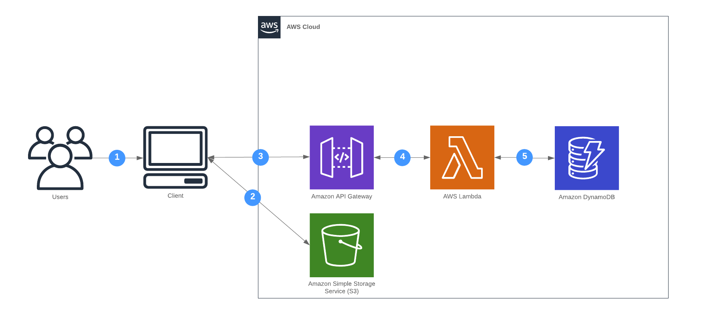

**In this Lab we will**:

- Deploy a Single Page App to S3
- Learn a thing or two about API Gateway
- Survive CORS Hell ;)

**You completed this lab if you**:

- Deployed the Frontend App manually via Make
- Can shorten URLs through your browser

## Overview

At the end of this lab the url shortener will consist of the following components.




## The Frontend App

We prepared a small React App (via [react-create-app](https://github.com/facebook/create-react-app)) that you can find 
here on [github.com](https://github.com/superluminar-io/sac-workshop-fe).

For convenience reasons we recommend that you add the following targets to your `Makefile`

1. Create a S3 bucket for hosting the web app

```makefile
AWS_REGION ?= eu-central-1
FE_REPO_NAME := serverless-workshop-fe

fe-bucket: guard-FE_BUCKET_NAME
	@ if [ `aws s3 ls | grep -e ' $(FE_BUCKET_NAME)$$' | wc -l` -eq 1 ]; then \
		echo "Bucket exists"; \
	else \
		aws s3 mb s3://$(FE_BUCKET_NAME) --region $(AWS_REGION); \
	fi
```

2. Fetch the initial version of the app from github

```makefile
fetch-frontend:
	rm -rf frontend
	wget https://github.com/superluminar-io/$(FE_REPO_NAME)/archive/master.zip -O master.zip
	unzip master.zip
	rm -f master.zip
	mv $(FE_REPO_NAME)-master frontend
```

3. Deploy the changes directly from the filesystem

```makefile
deploy-frontend: fe-bucket
	(cd frontend && npm install)
	(cd frontend && npm run-script build)
	(cd frontend && aws s3 sync build/ s3://$(FE_BUCKET_NAME) --delete --acl public-read)
	@ echo
	@ echo
	@ echo "https://$(FE_BUCKET_NAME).s3.$(AWS_REGION).amazonaws.com/index.html"
	@ echo
	@ echo
``` 

4. An additional guard helper target to check for the existence of certain environment vars
```makefile
guard-%:
	@ if [ -z '${${*}}' ]; then \
		echo "Environment variable $* not set"; \
		exit 1; \
	fi
```

**Attention**

The file `frontend/src/_aws-exports.js` must be renamed to `frontend/src/aws-exports.js` and the API endpoint needs
to be configured (including the stage `https://SOME_ID.execute-api.eu-central-1.amazonaws.com/Prod`).

## CORS

In order to call the API from within your Browser via JavaScript, you need to enable CORS handling in the API Gateway.
To read more about what CORS is all about: you can find a good explanation at [Mozillas Developer Docs](https://developer.mozilla.org/en-US/docs/Web/HTTP/CORS).

To configure CORS settings with the API Gateway, you need to 

- explicitly create a [AWS::Serverless::Api](https://github.com/awslabs/serverless-application-model/blob/master/versions/2016-10-31.md#awsserverlessapi) 
(until now this happened implicitly, because we where using [Event Source Type API](https://github.com/awslabs/serverless-application-model/blob/master/versions/2016-10-31.md#api))
- configure your function to make use of this API (see: `RestApiId` property of [API Event Type](https://github.com/awslabs/serverless-application-model/blob/master/versions/2016-10-31.md#api))
- set `AllowMethods`, `AllowHeaders` and `AllowOrigin` in the [Cors Configuration](https://github.com/awslabs/serverless-application-model/blob/master/versions/2016-10-31.md#cors-configuration)

## Hints
- Explicitly creating an `AWS::Serverless::Api` leads to a new API Gateway. This means the URL will change!
- You can find an example implementation here: https://github.com/superluminar-io/serverless-workshop-go/compare/lab1..lab2?expand=1
