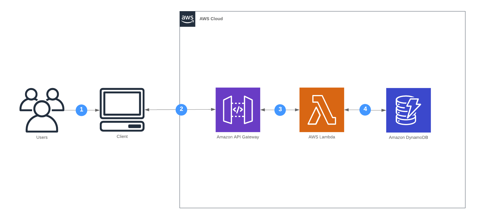

**In this Lab we will**:

- Create a first basic version of the url shortener
- Learn how to store data in AWS DynamoDB using the [AWS Java SDK](https://aws.amazon.com/sdk-for-java/)
- See some more advanced features of AWS SAM Templates

**You completed this lab if you**:

- Shortened at least one URL
- Typed the shortened URL into your browser and got redirected properly

## Overview

At the end of this lab the url shortener will consist of the following components.



## Implement a URL shortener using [DynamoDB](https://docs.aws.amazon.com/amazondynamodb/latest/developerguide/Introduction.html) for storage

- Implement one function to create a shortened URL via HTTP POST
- Implement one function to retrieve the full URL via HTTP GET issuing a `302 Found` redirect

Below you find an example interaction with your service:

```
$ curl -v -XPOST -d '{"url": "https://superluminar.io"}' https://$ENDPOINT

> POST / HTTP/1.1
< HTTP/1.1 Created 201
{"short_url": "https://$ENDPOINT/${short-id}"}

$ curl -v https://$ENDPOINT/${short-id}

> GET /${short-id} HTTP/1.1
< HTTP/1.1 302 Found
< Location: https://superluminar.io
```


sequenceDiagram
    participant Browser
    participant APIGateway
    participant Lambda
    participant DynamoDB
    Browser->>APIGateway: POST /
    APIGateway->>Lambda: Invoke
    Lambda->>DynamoDB: PutItem
    DynamoDB-->>Lambda: OK
    Lambda-->>Browser: HTTP 201 Created {"short_url": "https://foo/bar"}

    Browser->>APIGateway: GET /bar
    APIGateway->>Lambda: Invoke
    Lambda->>DynamoDB: GetItem
    DynamoDB-->>Lambda: OK
    Lambda-->>Browser: HTTP 302 Location: https://superluminar.io


## Hints

### Create a DynamoDB table
Make an addition to your CDK stack to define the DynamoDB table resource.
You need to add the DynamoDB package dependency in the `build.gradle` file.
Add the something like this to `ServerlessWorkshopStack.java`
```java
// Create DynamoDB table
Table table = Table.Builder.create(this, "dynamoDbTable")
    .partitionKey(Attribute.builder().name("id").type(AttributeType.STRING).build())
    .build();
```
For an overview of the DynamoDB package, [see here](https://docs.aws.amazon.com/cdk/api/latest/docs/aws-dynamodb-readme.html).

### Give your Lambda functions permissions to access the DynamoDB table

Take a look at the [`grantReadData`](https://docs.aws.amazon.com/cdk/api/latest/java/software/amazon/awscdk/services/dynamodb/Table.html#grantReadData-software.amazon.awscdk.services.iam.IGrantable-) method on your `Table` class.

### Inject the DynamoDB table via environment variables

Lambda functions have access to their [environment](https://docs.aws.amazon.com/cdk/api/latest/java/software/amazon/awscdk/services/lambda/Function.Builder.html#environment-java.util.Map-).
Define a variable and pass in the table name.

### Use the AWS SDK to query DynamoDB

Use the [AWS SDK](https://docs.aws.amazon.com/sdk-for-java/v2/developer-guide/setup-project-gradle.html) to read and write data from DynamoDB.
Setup a client like this:
```java
DynamoDBClient client = DynamoDbClient.builder()
    .credentialsProvider(EnvironmentVariableCredentialsProvider.create())
    .region(Region.of(System.getenv(SdkSystemSetting.AWS_REGION.environmentVariable())))
    .build();
```

Use the methods `getItem`/`putItem`.

### Use path parameters

Use [path parameters](https://docs.aws.amazon.com/apigateway/latest/developerguide/http-api-develop-routes.html#http-api-routes-path-variables) to inject the path value into your Lambda function. See `APIGatewayProxyRequestEvent.getPathParameters`.  

### Generate a short unique ID

Generate a short unique ID for the URL with a [fancy algorithm](https://github.com/snimavat/shortid).

## Cheating
You can find an example implementation here: https://github.com/superluminar-io/cdk-java-workshop/compare/lab0..lab1?expand=1
