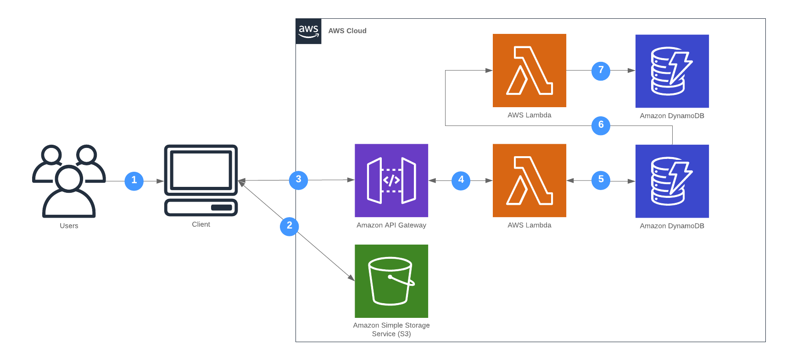

**In this Lab we will**:

- Use [DynamoDB Streams](https://docs.aws.amazon.com/amazondynamodb/latest/developerguide/Streams.html)
- Create an additional function and DynamoDB table

**You completed this lab if you**:

- Automatically store "preview information" for every new shortened url
- Took a look at the preview tables items as they get created

## Overview

At the end of this lab the url shortener will consist of the following components.

## Preview functionality

When pasting a URL into Twitter, Slack or similar we immediately see a preview. Let’s assume we want to save preview information for every URL we shorten. For each newly created short URL fetch a preview of the website and store it.

You have to:

- Create a new function
- Create a new DynamoDB table
- Hook up the function to a DynamoDB stream ([SAM example](https://github.com/awslabs/serverless-application-model/blob/master/versions/2016-10-31.md#dynamodb))
- Fetch a preview using e.g. https://github.com/badoux/goscraper
- Shorten a new url and check if a preview got stored

## Hints

You can find an example implementation here: https://github.com/superluminar-io/serverless-workshop-go/compare/lab2..lab3?expand=1
