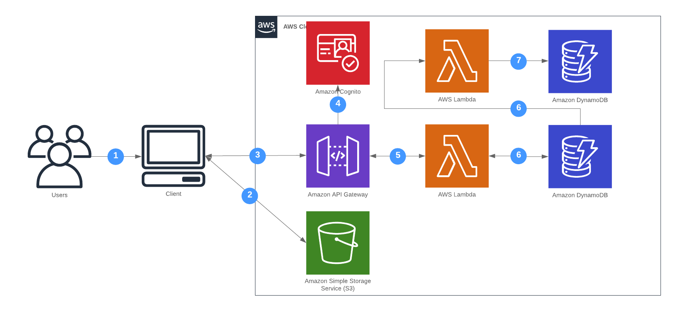

**In this Lab we will**:

- Create a Cognito User Pool
- Configure API Gateway to use that user pool for authentication
- Extend our frontend to allow *sign-up* and *sign-in*

**You completed this lab if you**:

- Can sign-up a new user via the frontend
- Can sign-in this user via the frontend
- Can still shorten URLs

## Overview

At the end of this lab the url shortener will consist of the following components.

## Cognito User Pool

Setting up a Cognito User Pool can be a bit tricky. In order to make it work, you need to:

- Create a [AWS::Cognito::UserPool](https://docs.aws.amazon.com/AWSCloudFormation/latest/UserGuide/aws-resource-cognito-userpool.html)
- Create a [AWS::Cognito::UserPoolClient](https://docs.aws.amazon.com/AWSCloudFormation/latest/UserGuide/aws-resource-cognito-userpoolclient.html) and connect it to the user pool
- Create an [Authorizer](https://github.com/awslabs/serverless-application-model/blob/master/versions/2016-10-31.md#api-auth-object) on the API Gateway
- [Use this authorizer](https://github.com/awslabs/serverless-application-model/blob/master/versions/2016-10-31.md#function-auth-object) with the functions you want to protect (maybe only `create-url` for now)
- Hint: Have a close look to the CORS property `AllowHeaders` you defined earlier

## Frontend Changes

In order to connect the frontend with Cognito and allow sign-in / sign-up, we need to:

- Configure the App via `aws-exports.js`
- Send the `Authorization` header with request that need to authorize ([example](https://aws-amplify.github.io/docs/js/api#cognito-user-pools-authorization))
- Set the `formType` to `signIn` or `signUp` in order to show the correct widget

## Hints

- You can find an example implementation here: https://github.com/superluminar-io/serverless-workshop-go/compare/lab3..lab4?expand=1
- Changes to the Frontend App (revert): https://github.com/superluminar-io/sac-workshop-fe/commit/5bbb8c9fab7705b3954f86d34981078b8e52261c
